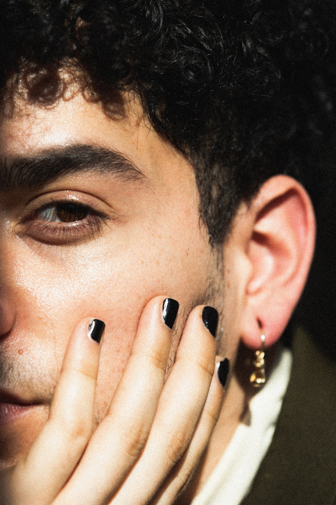

=====================
*अधीश का स्वयं से परिचय*
=====================

| डॉ. रिद्धिमा ने अशोक को पूरी कहानी बताई ।
और पूछा क्या उनके घर वालो को समझना चाहिए या पुलिस को बताना चाहिए?

| डॉ.अशोक ने जवाब दिया " सबसे पहले बच्चे को समझाने की जरूरत है।उसके मन की उलझन सुलझाने की जरूरत हैं ,अगर वो समझ गया तो फिर वो दुबारा इस तरह टूटेगा नहीं "

| बात तो आपकी ठीक हैं ,क्यों की उसकी जिंदगी आसान नहीं होगी और अगर वो स्वयं को स्वीकार कर ले तो शायद वो समाज से लड़ ले ।डॉक्टर रिद्धिमा ने जवाब दिया।

|*मुझे लगता है तुम्हे कुछ और सेशन करना चाहिए अधीश के " अशोक ने रिद्धिमा को देखते हुए कहा ।*

| हां । उसे खुद से मिलने की बहुत जरूरत हैं वरना दोनों खो जाएंगे ।चलो फिर शाम को घर पर बात करते है।ये कहते हुए रिद्धिमा केबिन से बाहर चली गई।

| रिद्धिमा ने अधीश के अगले सेशन में अधीश को बताया ...क्यों वो बाकी लडको से अलग हैं , बाकी से ज्यादा संवेदन शील हैं ,उसे क्यों वो खेल नहीं भाते जो अमूमन लडको को भाते हैं। 

| पर अधीश  तुम्हे खुद के व्यक्तित्व के लिए खुद ही  लड़ना होगा , और सच पूछो ये इतना आसान भी नहीं होता हैं।खुद को हर लिहाज मै स्वीकार करना ।

| अगले कुछ सेशन में रिद्धिमा ने अधीश को उसके जैसे बाकी लोगों लोगों से मिलाया .... जो अपने क्षेत्र में  बेहतरीन कार्य कर रहे थे ।

| रिद्धिमा ने अधीश को बताया जितनी भी एल.जी . टी समाज है ,सारे किस तरह अपना जीवन यापन कर रहे हैं।

| हां ये सच है अधीश को कुछ वक़्त लगा खुद को स्वीकारने में पर अब जब खुद को स्वीकार लिया तो सारी ज़िन्दगी  खुद का साथ ना छोड़ने का स्वीकार कर लिया था ।

| पर क्या जब समाज ताने मार कर तुम्हारे व्यक्तित्व पर हंसेगा, कही खुद का साथ छोड़ तो नहीं दोगे ? रिद्धिमा ने अधीश से पूछा।

| अधीश ने जवाब दिया - 
*शायद हर दिन टूट जाऊ या फिर खुद से रूठ जाऊ पर फिर भी कर रोज खुद को मनाऊंगा और समेट कर फिर लड़ूंगा ।*

| रिद्धिमा अधीश  के जवाब से चकित थी ।उसने अधीश से उसके घर का पता लिया ।रिद्धिमा ने निर्णय लिया था  वह  वहां जा कर अधीश के पिता से बात करने की कोशिश करेंगी।

